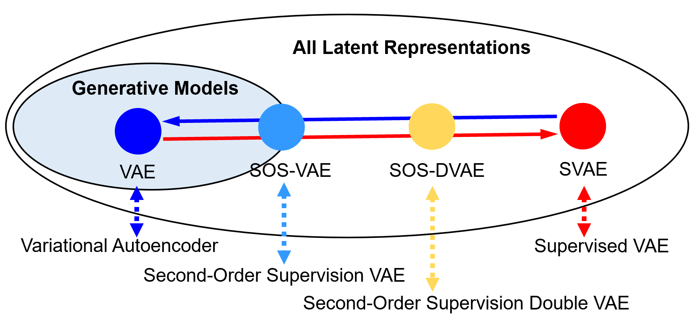
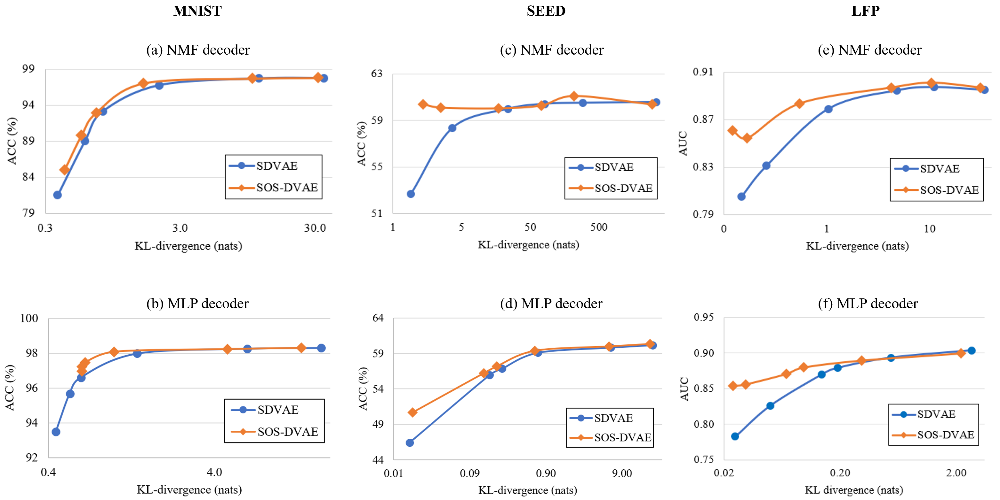

# Implementation of "Supervising the Decoder of Variational Autoencoders to Improve Scientific Utility" [(arxiv preview)](https://arxiv.org/abs/2109.04561)

<div align="center">
<a href ="#" target="_blank">Liyun Tu </a>, 
<a href ="#" target="_blank">Austin Talbot</a>, 
<a href ="#" target="_blank">Neil Gallagher</a>, 
<a href ="#" target="_blank">David Carlson</a>
</div>

<br>
We developed an interpretable and explainable probabilistic generative model that offers both an accurate representation of the input data and an effective prediction of outcomes relevant to scientific questions. The framework maintains the interpretation of the variational encoder as an unbiased approximation to the posterior while inducing the latent representation to be predictive of an auxiliary variable. We examined the framework on synthetic data and electrophysiological recordings with an emphasis on how our learned representations can be used to design scientific experiments.
<br><br>
The following picture demonstrates the relationship among the proposed models (SOS-VAE and SOS-DVAE, detailed in Section III), a generative model (VAE) and a predictive model (SVAE).  Blue indicates a model pursues a lower reconstruction error (better generative performance), and red denotes that a model pursues a higher predictive performance. Both VAE and SOS-VAE try to find latent representations that only use information in the proper generative model family, with SOS-VAE trying to find a representation that is good at prediction from within the model family.


<p align="center">
    
</p>

## Tested environment
Python 3.7.6</br>
CUDA 10.1</br>
Pytorch 1.5.1</br>
Scikit-learn 0.21.2</br>
MNE 0.21.0</br>

## Set up file path and parameters for each dataset
We have evaluated the proposed models (SOS-VAE and SOS-DVAE) on synthetic data and electrophysiological recordings. In the following, $DATA_DIR indicates the location where the dataset is stored, $PROJECT_DIR refers to the directory where the project code is stored, $OUT_DIR indicates the location where the intermediate outputs and models will be saved, $DATA_FLAG indicates the dataset to be processed, and $DECODER_FLAG refers to the selection to use MLP decoder or NMF decoder.

<details>
    <summary>Synthetic data (MNIST)</summary>

The dataset will be downloaded automatically, when you run main_cv.py for the first time. You can use --dataDir $DATA_DIR/mnist, so that the datasets are downloaded to the corresponding directories.
```shell script
    DATASET_NAME=mnist
    
```
+ Set to use NMF decoder
```shell script
    DECODER_NAME=nmf
```
+ Set to use MLP decoder
```shell script
    DECODER_NAME=mlp
```
</details>

<details>
    <summary>Electroencephalogram (EEG) recordings</summary>
 
The dataset is available upon request from the owner: http://bcmi.sjtu.edu.cn/home/seed/
Download the dataset and save it in $DATA_DIR/seed folder.
```shell script
    DATASET_NAME=seed
    INVMU=1
    SIM_LOSS_SCALE=0.1
```
+ Set to use NMF decoder
```shell script
    DECODER_NAME=nmf    
    REC_KL_SCALE=1e-4
```
+ Set to use MLP decoder
```shell script
    DECODER_NAME=mlp
    REC_KL_SCALE=0.1
```

</details>

<details>
    <summary>Local field potential (LFP) recordings</summary>
 
This dataset is currently in the preparation stage to make it public by the original lab [cite cell paper]. We will update this section when it is ready for use.

</details>

The following figure show the prediction performance against the KL-divergence on all three datasets using MLP
decoders. We can see that the proposed SOS-DVAE obtains higher predictive performance (ACC or AUC) for the same
level of KL-divergence.
<br /><br />
<p align="center">
    
</p>
<br />

## Running the main training and evaluation scripts
```shell script
    export DATA_DIR=PATH_TO_DATA_DIR
    export PROJECT_DIR=PATH_TO_CODE_DIR
    export OUT_DIR=PATH_TO_OUTPUT_DIR
    export DATA_FLAG=DATASET_NAME
    export DECODER_FLAG=DECODER_NAME
    export INVMU=INVMU
    export REC_KL_SCALE=REC_KL_SCALE
    export SIM_LOSS_SCALE=SIM_LOSS_SCALE
    cd $PROJECT_DIR     
    python main_cv.py --dataDir $DATA_DIR --decoder_fn decoder_$DECODER_FLAG --out_path $OUT_DIR --invmu INVMU --rec_kl_scale REC_KL_SCALE --sim_loss_scale SIM_LOSS_SCALE --dataset_name $DATA_FLAG 
```

## Calculation of the Scientific Utility Metric
### Refit encoder with pretrained different models

### MLP
```shell script
python main_cv_sciUtil.py --decoder_fn DECODER_FLAG --out_path OUT_DIR --dec_model_pathname MODEL_FILENAME --rec_kl_scale 0.001
```

The MODEL_FILENAME is the corresponding one begain with "MLP_" in folder models\LFP\refit-encoder

### NMF
```shell script
python main_cv_sciUtil.py --decoder_fn DECODER_FLAG --out_path OUT_DIR --dec_model_pathname MODEL_FILENAME --rec_kl_scale 0.001 --out_features 20
```
The MODEL_FILENAME is the corresponding one begain with "NMF_" in folder models\LFP\refit-encoder


## Bibtex
Please cite our paper, if you happen to use this codebase:
```
@misc{tu2021supervising,
      title={Supervising the Decoder of Variational Autoencoders to Improve Scientific Utility}, 
      author={Liyun Tu and Austin Talbot and Neil Gallagher and David Carlson},
      year={2021},
      eprint={2109.04561},
      archivePrefix={arXiv},
      primaryClass={stat.ML}
}
```
